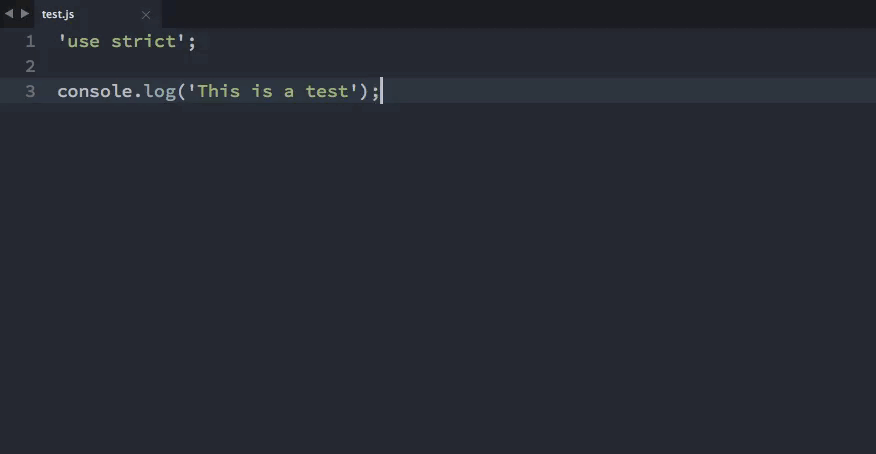

# stream-notifier

> stream-notifier makes it easy to setup native Mac, Windows and Linux notifications (using [notifier](https://www.npmjs.com/package/node-notifier)) for error- and success-reporting in streams.



## Using stream-notifier with gulp:

``` js
var streamNotifier = require('stream-notifier');

gulp.task('styles', function() {
  var notify = streamNotifier('styles');

  return gulp
    .src('src/main.styl')
    .pipe(stylus({ use: [jeet(), rupture(), normalize()] }))
    .on('error', notify.error)
    .pipe(rename('app.css'))
    .pipe(gulp.dest('dist'))
    .on('end', notify.end);
});
```